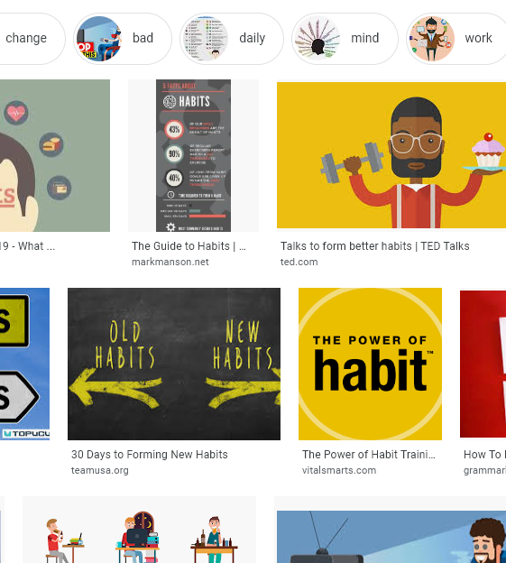

# On habits

Doing something regularly is the key to getting a significant and lasting benefit from it. It seems you can experience cathartic events in life that might change the way you look at things but the intensity of the experience fades after a while and you are still you but with a different take on things. These experiences are not always intentional, life seldom works out as planned and the big events in life are no exception. 

Another way we change that can be more intentional is when there is a habit we follow that produces incremental benefits. These benefits can be fine tuned to suit our goals. If something goes wrong, it is just one day in long series of days, and you get another chance the next time you do the habit.

We might choose to make it a habit to always fill half the plate with vegetables, or maybe we go for a walk everyday. In a way these good habits are no different than bad habits. If you have a habit of not exercising, you do it with the same commitment. The choice is yours to make the good habit or the bad habit. 

Next level habits are those we can track and quantify easily like keeping track of how many words you write a day, how many pushups, or hours worked. When we do this we can see improvements or at least verify we are meeting our goals. You can modify these day to day by small amounts or just do the bare minimum to keep the habit when you aren't feeling like it. 

Really, this is the key to changing your capabilities for better or worse. The big events change the way you think but the little, repetitive events are the ones that change how we use those thoughts, what we can do, and how we act.

