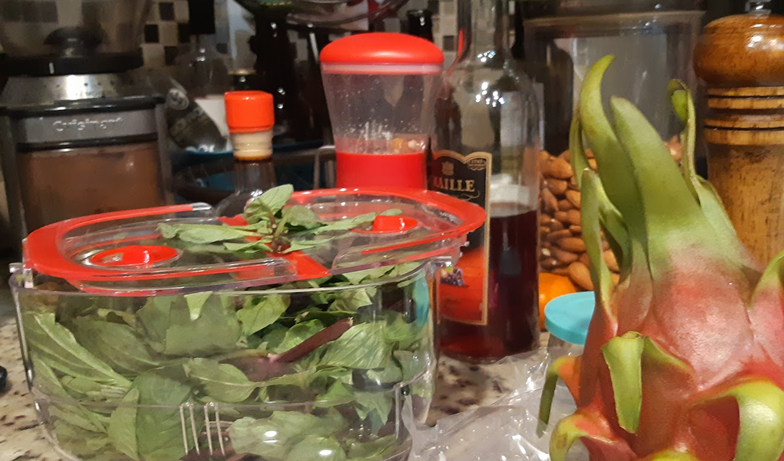

# Weekend 2020-03-01

Had a really nice weekend. Despite some snow, the weather here has obviously turned a corner and we are entering Spring weather, albeit early Spring. My son is loving his outdoor time, as are we all. We had a pretty chill weekend, I only went out to take our son to his various weekend activities - one of which involved getting a haircut. 

I wish I could tell you I had some live-changing discovery or thought to share, but I don't. I just have the memory of a great weekend spent with a loving family, in nice weather, with the hope of Spring around the corner. 

I dusted off my poor, neglected TODO list and brought it up to date, called my family back home, and slept way more than normal. I analyzed my daily weights and found I wasn't going down as fast as I would like, but the trend line is still negative. This inspired me to eat less last night as a snack (I had a small bowl of popcorn and it was earlier in the evening). 

With COVID-19 going around, I am not super-excited about flying with my son soon but there's nothing for it. We have to go and want to go. We'll just have to be careful and use precautions and I will try not think of the movie Contagion. 

Meanwhile, check this out:

<iframe width="560" height="315" src="https://www.youtube.com/embed/Kbkc_0Ns6q0" frameborder="0" allow="accelerometer; autoplay; encrypted-media; gyroscope; picture-in-picture" allowfullscreen></iframe>