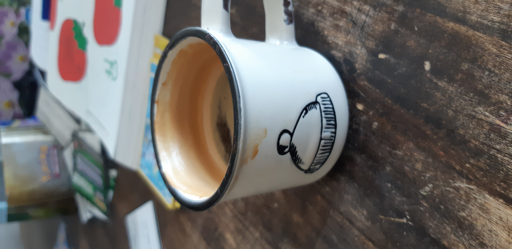

# The Plague - 2020-03-24

This was the second Monday of our self-isolation. The weekend was great. I took our son sledding at a hill where there was only one other group and they were 50m or more away at all times. Then, on Sunday, we drove to a cabin in the woods, no one around, and roasted marshmallows outside. It was a beautiful day.

Today was us settling into a pattern that will soon seem normal but isn't quite there yet. Our son was well behaved and only got impatient a couple of times, which is understandable. We mixed educational activities with recreational ones when there was screen time, added in some crafts and physical exercise, peeling potatoes for dinner, a short dance party, then charades to end the day. We practiced our numbers using a game his teacher sent us (printed out from a PDF) and increased vocabulary by playing a game where you say all the words you can think of starting with a certain letter.

While work is as brisk as ever, our out of work life seems more measured and thougtful. There's more time to connect. I am enjoying that.

